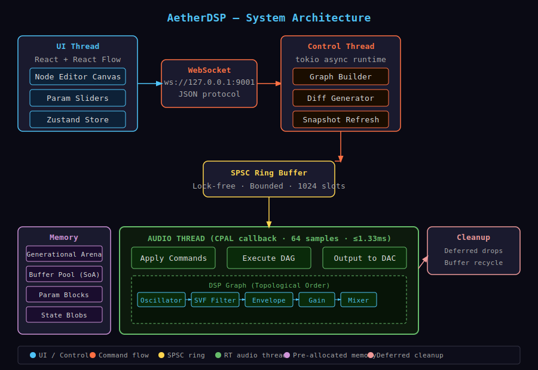

# AetherDSP

[](https://www.rust-lang.org)
[](#)
[](LICENSE)
[](#)
[](#)
[](#)
[](https://github.com/1yos/aether-dsp)

A deterministic, hard real-time modular DSP runtime in Rust.

```
64-sample buffer · 48 kHz · ≤1.33 ms deadline · Zero XRuns · Lock-free
```

## Architecture



## Quick Start

### Prerequisites

| Tool              | Version | Notes                          |
| ----------------- | ------- | ------------------------------ |
| Rust              | 1.78+   | `stable-x86_64-pc-windows-gnu` |
| MSYS2 MinGW64 GCC | 13+     | Required linker on Windows     |
| Node.js           | 18+ LTS | For the UI                     |

### Windows Setup (one-time)

```powershell
# 1. Install Rust
winget install Rustlang.Rustup
rustup default stable-x86_64-pc-windows-gnu

# 2. Install MSYS2 + MinGW GCC
winget install MSYS2.MSYS2
C:\msys64\usr\bin\bash.exe -lc "pacman -S --noconfirm mingw-w64-x86_64-gcc"

# 3. Create junction to avoid spaces in path (Windows only)
New-Item -ItemType Junction -Path "C:\aether-dsp" -Target "D:\path\to\aether-dsp"
```

### Build & Run

```powershell
# Set PATH so MSYS2 GCC is found
$env:PATH = "C:\msys64\mingw64\bin;" + $env:PATH

# Check
Set-Location C:\aether-dsp
cargo check --workspace

# Release build
cargo build --release

# Run audio host (requires audio output device)
cargo run -p aether-host --release

# Benchmarks
cargo bench -p aether-core

# UI (separate terminal)
Set-Location "D:\path\to\aether-dsp\ui"
npm install
npm run dev   # http://localhost:5173
```

## Project Structure

```
aether-dsp/
├── .cargo/config.toml          # Linker config (MSYS2 MinGW)
├── Cargo.toml                  # Workspace
├── docs/
│   ├── architecture.svg        # System diagram
│   ├── RELEASE_CHECKLIST.md
│   └── paper_draft.md          # Conference paper draft
├── crates/
│   ├── aether-core/            # RT engine: arena, graph, scheduler, params
│   ├── aether-nodes/           # DSP nodes: osc, filter, env, delay, gain, mixer
│   ├── aether-host/            # CPAL audio host + WebSocket bridge
│   └── aether-plugin/          # CLAP plugin (NIH-plug wrapper)
└── ui/                         # React + React Flow node editor
```

## Real-Time Guarantees

| Rule                            | Enforcement                                |
| ------------------------------- | ------------------------------------------ |
| No heap allocation in RT thread | Pre-allocated arena + buffer pool          |
| No locks in RT thread           | SPSC ring buffer (ringbuf)                 |
| No I/O in RT thread             | All I/O on control/tokio threads           |
| Bounded execution               | Flat topo-sorted array, ≤32 commands/tick  |
| No recursion                    | Iterative Kahn's sort, iterative execution |

## Benchmark Results

| Benchmark                   | Result      |
| --------------------------- | ----------- |
| `param_fill_buffer_64`      | **51.7 ns** |
| Arena insert/remove ×1000   | < 5 µs      |
| Scheduler (1000 noop nodes) | < 100 µs    |

## WebSocket Protocol

Connect to `ws://127.0.0.1:9001` (started by `aether-host`).

```json
// Update a parameter with 20ms ramp
{ "type": "update_param", "node_id": 0, "generation": 0,
  "param_index": 0, "value": 880.0, "ramp_ms": 20 }

// Request current graph snapshot
{ "type": "get_snapshot" }
```

## Version Roadmap

| Version | Milestone                               |
| ------- | --------------------------------------- |
| v0.1    | Real-time audio engine + UI + WebSocket |
| v0.2    | CLAP plugin (NIH-plug)                  |
| v0.3    | SIMD vectorization                      |
| v0.4    | Parallel layer execution (Rayon)        |
| v0.5    | GPU convolution (WGPU)                  |
| v1.0    | Stable public release                   |

## License

MIT
